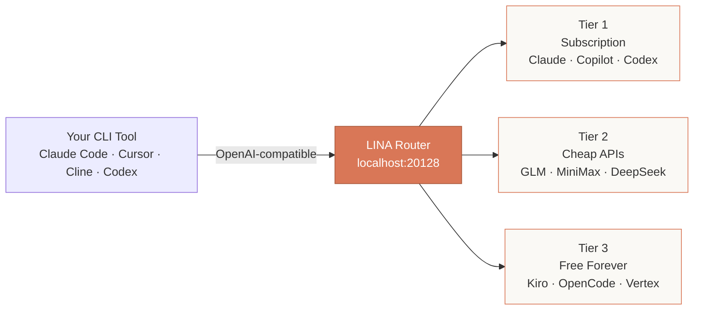
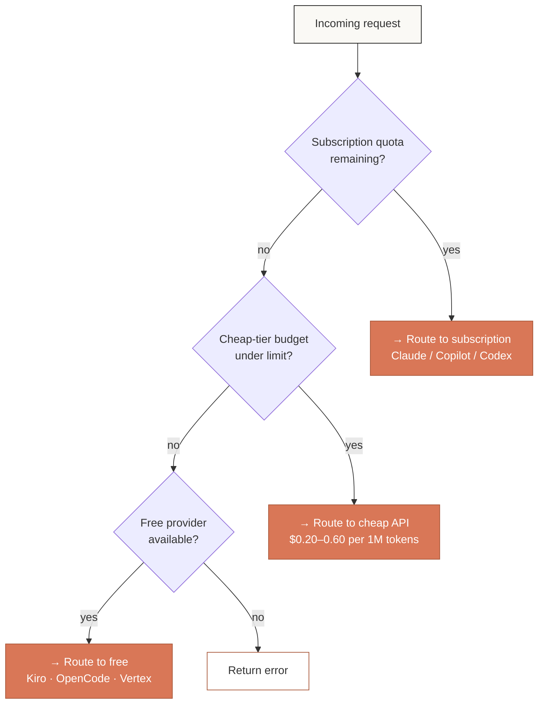
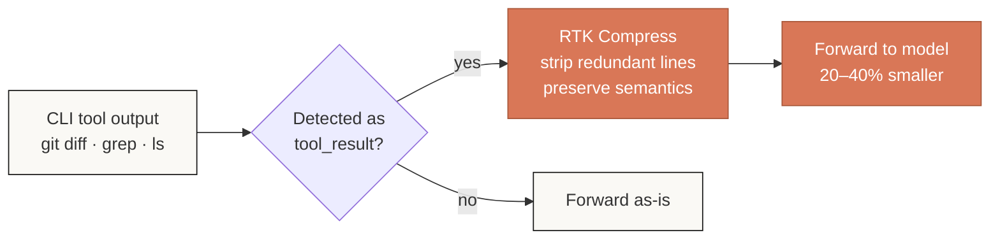

<div align="center">
  

  # LINA Router

  ***Never stop coding.***
  Route any AI tool to *40+ providers* — and let the cheap ones write the boring parts.

  [](https://www.npmjs.com/package/lina-router)
  [](https://www.npmjs.com/package/lina-router)
  [](LICENSE)
  [](https://github.com/spooky-may/lina-routerrr)

  [Get Started →](#-quick-start) · [Docs](https://lina-router.com/docs) · [Site](https://lina-router.com)
</div>

---

<div align="center">

| **40+** | **100+** | **20–40%** | **$0** |
|:---:|:---:|:---:|:---:|
| providers | models | tokens saved | to start |

</div>

---

## What is this?

LINA Router is a *local proxy* that sits between your AI coding tools (Claude Code, Cursor, Cline, Codex, anything OpenAI-compatible) and the AI providers themselves. It does three things you didn't know you needed:

1. **Compresses tool outputs** before they reach the model. `git diff` going from 4,200 tokens to 2,600. *Every request, automatically.*
2. **Falls back gracefully** when your subscription quota runs out — to cheap APIs, then to free models. *You never see a rate limit.*
3. **Speaks every dialect.** OpenAI, Anthropic, Gemini, custom — point your tool at `localhost:20128/v1` and it just works.

Built for engineers who hate paying $50/month for tokens they could have saved. Runs entirely on your machine.

---

## 📐 How it routes



---

## ⚡ Quick Start

```bash
npm install -g lina-router
lina-router
```

Dashboard opens at `http://localhost:20128`. Connect a free provider (Kiro takes 10 seconds, no signup), then point your tool:

```bash
export ANTHROPIC_BASE_URL=http://localhost:20128/v1
export ANTHROPIC_API_KEY=<your-lina-router-key>
claude
```

*That's the entire install.*

---

## 🧭 How fallback decides

When a request comes in, LINA Router asks three questions in order. The first **yes** wins:



You can reorder tiers, lock specific models, or run multi-account round-robin within a tier. *Whatever keeps you coding.*

---

## 💎 Features

| | |
|---|---|
| **🚀 RTK Token Saver** | Auto-compresses `git diff`, `grep`, `ls`, `tree` tool outputs *before* they reach the model. 20–40% smaller, same fidelity. |
| **🔄 Auto Fallback** | Subscription → Cheap → Free. Zero downtime, zero intervention. You'll know it switched because the dashboard told you. |
| **👥 Multi-Account** | Got three Claude Code accounts? LINA round-robins between them to dodge rate limits and squeeze every quota. |
| **🌐 Universal** | One endpoint. Works with Claude Code, Cursor, Cline, Codex, Copilot, Continue, OpenCode — anything OpenAI-compatible. |

---

## 🪶 RTK — the boring genius

Most of your tokens aren't prose. They're *tool outputs* — `git diff` against a 50-file refactor, `grep -r` across a monorepo, `ls -la` of a node_modules tree. RTK looks at those, strips the redundant parts, and forwards a leaner version. The model still gets what it needs. Your wallet doesn't.



*One request rarely matters. Ten thousand do.*

---

## 🛠️ Tools that work today

<div align="center">
  <table>
    <tr>
      <td align="center" width="120">Claude Code</td>
      <td align="center" width="120">Cursor</td>
      <td align="center" width="120">Cline / Roo</td>
      <td align="center" width="120">Codex CLI</td>
      <td align="center" width="120">Copilot</td>
    </tr>
    <tr>
      <td align="center" width="120">OpenCode</td>
      <td align="center" width="120">Continue</td>
      <td align="center" width="120">Kilo Code</td>
      <td align="center" width="120">Antigravity</td>
      <td align="center" width="120">OpenClaw</td>
    </tr>
  </table>
  <p><i>… plus anything that speaks OpenAI / Anthropic API.</i></p>
</div>

---

## 🌐 Providers

### 🔐 OAuth (your subscription)

<div align="center">
  <table>
    <tr>
      <td align="center" width="120">
        <br/>
        <b>Claude Code</b>
      </td>
      <td align="center" width="120">
        <br/>
        <b>Antigravity</b>
      </td>
      <td align="center" width="120">
        <br/>
        <b>Codex</b>
      </td>
      <td align="center" width="120">
        <br/>
        <b>Copilot</b>
      </td>
      <td align="center" width="120">
        <br/>
        <b>Cursor</b>
      </td>
    </tr>
  </table>
</div>

### 🆓 Free forever

<div align="center">
  <table>
    <tr>
      <td align="center" width="160">
        <br/>
        <b>Kiro AI</b><br/>
        <sub>Claude 4.5 + GLM-5 + MiniMax<br/>Unlimited · no signup</sub>
      </td>
      <td align="center" width="160">
        <br/>
        <b>OpenCode Free</b><br/>
        <sub>No auth · auto-fetch models<br/>Unlimited</sub>
      </td>
      <td align="center" width="160">
        <br/>
        <b>Vertex AI</b><br/>
        <sub>Gemini 3 Pro + GLM-5 + DeepSeek<br/>$300 credits</sub>
      </td>
    </tr>
  </table>
</div>

### 🔑 API key (40+ more)

OpenRouter · GLM · Kimi · MiniMax · OpenAI · Anthropic · Gemini · DeepSeek · Groq · xAI · Mistral · Perplexity · Together · Fireworks · Cerebras · Cohere · NVIDIA · SiliconFlow · Nebius · Chutes · Hyperbolic · *and 20 more, plus any OpenAI/Anthropic-compatible endpoint.*

---

## 💰 Pricing reality check

| Tier | Provider | Cost | Best for |
|---|---|---|---|
| **RTK** *(built-in)* | LINA Router | **$0** | *Saves 20–40% on every request* |
| Subscription | Claude Code (Pro/Max) | $20–200/mo | Already a subscriber |
| Subscription | Codex (Plus/Pro) | $20–200/mo | OpenAI heavy users |
| Subscription | Copilot | $10–19/mo | GitHub-native |
| Cheap | GLM-5 | $0.6 / 1M tokens | Budget backup |
| Cheap | MiniMax M2.7 | $0.2 / 1M tokens | *Cheapest paid option* |
| Cheap | Kimi K2.5 | $9 / mo flat | Predictable monthly |
| Free | Kiro AI | **$0** | Unlimited Claude 4.5 |
| Free | OpenCode Free | **$0** | No auth, no signup |
| Free | Vertex AI | $300 credits | New GCP accounts |

**The combo:** RTK + Kiro + OpenCode = `$0` cost, `−40%` tokens. *We were not paid to recommend it; it's just the math.*

> **No, LINA Router never bills you.** The dashboard shows "saved $290 this month" — that's the money you didn't spend. It's an open-source binary running on your laptop. There is no card to charge.

---

## 🎯 Who this is for

**"I have Claude Pro and keep hitting limits."**
LINA round-robins across your accounts, then falls back to Kiro free when you're out. Same model, no interruption.

**"My GLM API bill keeps growing."**
RTK alone cuts 30% off every request. Free Kiro tier absorbs the rest. Bill goes down.

**"I want to try Cursor without paying."**
Point Cursor at `localhost:20128/v1`. Connect Kiro. You now have Cursor running on free Claude 4.5.

---

## 📦 Install variants

<details>
<summary><b>Local development from source</b></summary>

```bash
git clone https://github.com/spooky-may/lina-routerrr.git
cd lina-routerrr
pnpm install
pnpm dev
```

Dashboard at `localhost:20128`. Hot reload enabled.

</details>

<details>
<summary><b>Docker</b></summary>

```bash
docker build -t lina-router .
docker run -d \
  --name lina-router \
  -p 20128:20128 \
  -v lina-router-data:/app/data \
  lina-router
```

Data persists in the `lina-router-data` volume.

</details>

<details>
<summary><b>PM2 (production)</b></summary>

```bash
git clone https://github.com/spooky-may/lina-routerrr.git
cd lina-routerrr && pnpm install && pnpm build
pm2 start ecosystem.config.cjs
pm2 save && pm2 startup
```

</details>

---

## 🧠 Tech under the hood

<details>
<summary><b>Stack</b></summary>

- **Runtime:** Node.js 18+, Next.js 16 (App Router)
- **DB:** SQLite (better-sqlite3) for local persistence
- **Cloud worker:** Cloudflare Workers + D1 (optional, for cross-device sync)
- **Tunnel:** Tailscale Funnel + Cloudflare Quick Tunnels
- **MITM (for Copilot/Kiro):** mitmproxy with custom Node bridge
- **OAuth:** 14+ provider-specific implementations (Claude, GitHub, Gemini, Cursor, …)
- **Telemetry:** in-process event ring buffer + JSONL drain
- **Health:** per-provider circuit breaker (closed → open → half-open)

</details>

<details>
<summary><b>Architecture notes</b></summary>

- All routing logic lives in `open-sse/` (handlers, account fallback, combo routing)
- Dashboard is a Next.js app at `/dashboard`
- Provider OAuth flows in `src/lib/oauth/services/{provider}.js`
- Database repos in `src/lib/db/repos/`
- MCP plugin bridge: `src/lib/mcp/stdioSseBridge.js` exposes stdio MCP servers over SSE
- Observability: `src/lib/analytics/eventTelemetry.js` (events) + `src/lib/healthcheck/healthMonitor.js` (circuit breakers)

</details>

<details>
<summary><b>API reference</b></summary>

LINA Router exposes an OpenAI-compatible `/v1/chat/completions` endpoint at `localhost:20128`. Models are referenced via prefixes that map to providers:

| Prefix | Meaning |
|---|---|
| `kr/` | Kiro AI |
| `cx/` | Codex / OpenAI |
| `ag/` | Antigravity |
| `gh/` | GitHub Copilot (MITM) |
| `or/` | OpenRouter |
| *(any model id)* | Default routing rules apply |

Example: `kr/claude-sonnet-4.5` routes through Kiro using Claude 4.5.

Full OpenAPI spec at `/api/openapi.json` once you're running locally.

</details>

<details>
<summary><b>Troubleshooting</b></summary>

- **Dashboard won't open?** Check port 20128. `lsof -i :20128` (mac/linux) or `netstat -ano | findstr :20128` (windows).
- **MITM error for Copilot/Kiro?** Trust the LINA root CA. Dashboard → Settings → Install Certificate.
- **OAuth callback fails?** Make sure no other tool is bound to localhost:20129. That's the callback port.
- **High RAM usage?** SQLite cache. Run `Settings → Maintenance → Compact DB`.

</details>

---

## ❓ FAQ

**Is LINA Router free?**
Yes. MIT licensed. No paywall, no telemetry-to-server, no "premium tier." You pay providers directly; LINA just routes.

**Does it work offline?**
The router does (after install). Providers, obviously, don't.

**Will my OAuth tokens leak?**
Tokens live in `~/.lina-router/` (or `DATA_DIR`) as SQLite rows. Same security model as your shell history. No cloud sync unless you explicitly enable it.

**Can I add a custom provider?**
Yes. Dashboard → Providers → Custom → paste the endpoint. Anything OpenAI-compatible works out of the box.

**Why "LINA"?**
It's just a name. *No, there's no token.*

---

## 🙏 Built on

- [RTK](https://github.com/rtk-ai/rtk) — the token compressor that does the heavy lifting
- [Next.js](https://nextjs.org), [Tailwind](https://tailwindcss.com), [better-sqlite3](https://github.com/WiseLibs/better-sqlite3)
- [Cloudflared](https://github.com/cloudflare/cloudflared), [Tailscale](https://tailscale.com)

---

<div align="center">

**LINA Router** · [GitHub](https://github.com/spooky-may/lina-routerrr) · [Site](https://lina-router.com) · [Docs](https://lina-router.com/docs)

*MIT License — free as in beer, free as in speech.*

</div>
